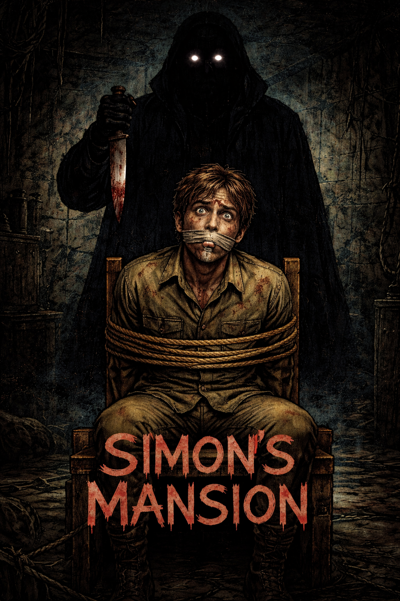

<p align="center">
  
  
  
  
</p>

<h1 align="center">LA MANSION DE SIMON</h1>

<p align="center">
  <i>Una historia de secretos, silencios y supervivencia</i>
</p>

<p align="center">
  
</p>

---

## Sinopsis

Son las tres de la tarde. Una mansión antigua recibe a **cinco desconocidos** que, sin embargo, no lo son del todo entre sí. Los une un nombre: **Simón**. Un pintor. Un hombre que, según les comunicaron hace pocos días, ha muerto.

Pero cada uno llegó con algo más que condolencias. Cada uno llegó con **una razón propia, silenciosa**, que no piensa compartir con nadie.

Lo que ninguno sabe es que **no están solos**. En algún rincón de la casa, alguien más aguarda. Alguien que también tiene una razón para estar ahí, y esa razón es mucho más oscura que todas las demás juntas.

> *El jugador observa. El jugador explora. El jugador decide quién sobrevive.*

---

## Cómo Jugar

```bash
python la_mansion_de_simon.py
```

**Requisitos:** Python 3.7 o superior. Sin dependencias externas.

El juego se controla completamente con el teclado. Lee, explora, elige. Cada decisión tiene consecuencias permanentes.

---

## Mecánicas

### Sistema de Aislamiento

No es el asesino lo que mata a los personajes directamente. **Es la soledad.** El asesino solo termina lo que el aislamiento empezó.

Cada personaje tiene un nivel de aislamiento (0-100) que funciona como la verdadera tensión narrativa del juego:

| Acción | Efecto |
|--------|--------|
| Completar un capítulo sin hablar con alguien | **+25** aislamiento |
| Descubrir una pista que contradice a un personaje | **+10** aislamiento |
| Completar una interacción con un personaje | **-20** aislamiento |
| Encontrar una pista que valida su historia | **-10** aislamiento |
| Terminar capítulo con todos presentes | **-5** colectivo |

Si el aislamiento de un personaje supera **75** al final de un capítulo, esa persona se separará del grupo. Y quien se separa del grupo en esta mansión **no sobrevive**.

### Exploración Libre

Cada escenario tiene pistas ocultas que puedes examinar libremente. Lo que encuentres (o dejes de encontrar) cambia el curso de la historia.

### Decisiones con Consecuencias

Cada capítulo termina con una decisión que afecta directamente:
- Quién vive y quién muere
- Qué información tienes disponible
- Cómo termina la historia

---

## Los Cinco Escenarios

```
                    ┌─────────────────────┐
                    │   ALA NORTE         │
                    │   (El Rescate)      │
                    │   5 puertas         │
                    └────────┬────────────┘
                             │
        ┌────────────────────┼────────────────────┐
        │                    │                    │
  ┌─────┴─────┐      ┌──────┴──────┐      ┌──────┴──────┐
  │ HABITACIÓN│      │   LOBBY     │      │  GALERÍA    │
  │ DE SIMÓN  │      │  (Central)  │      │  (Taller)   │
  │ 2do piso  │      │  Planta baja│      │  Ala sur    │
  └───────────┘      └──────┬──────┘      └─────────────┘
                            │
        ┌───────────────────┼───────────────────┐
        │                                       │
  ┌─────┴─────┐                          ┌──────┴──────┐
  │ ESTUDIO   │                          │   SALA DE   │
  │ DE SIMÓN  │                          │   CÁMARAS   │
  │ Ala este  │                          │   Sótano    │
  └───────────┘                          └─────────────┘
```

---

## Los Personajes

| Personaje | Rol | Secreto |
|-----------|-----|---------|
| **Ben** (38) | El Dinero | Desvió fondos de Simón durante años. Busca destruir el libro de cuentas. |
| **Lisa** (31) | La Evidencia | Tiene copias de pruebas de un crimen. Busca los originales. |
| **Robert** (54) | La Carta | Hermano secreto de Simón. Busca una carta comprometedora del padre. |
| **Ana** (45) | Las Joyas | Usó joyas familiares como garantía sin permiso. Necesita recuperarlas. |
| **Lucas** (27) | El Relicario | Tomó un relicario de plata de Simón. Necesita devolverlo. |
| **Simón** (61) | El Pintor | No está muerto. Está retenido en su propia mansión. |

---

## El Final

El juego tiene **un solo final**. No importa lo que hagas, la mansión gana. Lo que cambia según tus decisiones es cómo llegas ahí, cuántos sobreviven, y qué tan profundo cavas en la verdad antes de que la verdad te encuentre a ti.

Tus decisiones determinan:
- Cuántos llegan vivos al desenlace
- Qué pistas descubriste sobre la verdadera naturaleza de Simón
- Qué tan perturbadora es la revelación final
- Cuánto de la verdad puedes soportar antes de que la mansión cierre el ciclo

---

## Estructura

```
la-mansion-de-simon/
├── SIMONS_MANSION.png         # Portada del juego
├── la_mansion_de_simon.py     # Juego completo
└── README.md                  # Este archivo
```

---

## Captura

```
  ══════════════════════════════════════════════════════════════
                    C A P Í T U L O   1
                   La Llegada — 3:00 PM
  ══════════════════════════════════════════════════════════════

    El primero en llegar fue Robert. Lo hizo con diez minutos
    de adelanto, como hacía siempre, como si la puntualidad
    fuera una forma de demostrar que tenía el control de algo.

  -- Estado del grupo ------------------------------------------

    Ben       ██░░░░░░░░  20  ~ medio
    Lisa      ░░░░░░░░░░   0  estable
    Robert    ███░░░░░░░  30  ~ medio
    Ana       █░░░░░░░░░  10  estable
    Lucas     ░░░░░░░░░░   0  estable
```

---

## Créditos

- **Guión y diseño narrativo:** Biblia de juego original — *La Mansión de Simón*
- **Desarrollo:** Adaptación a consola en Python

---

<p align="center">
  <i>"Algunos solo tienen miedo."</i>
  <br>
  — Simón
</p>
